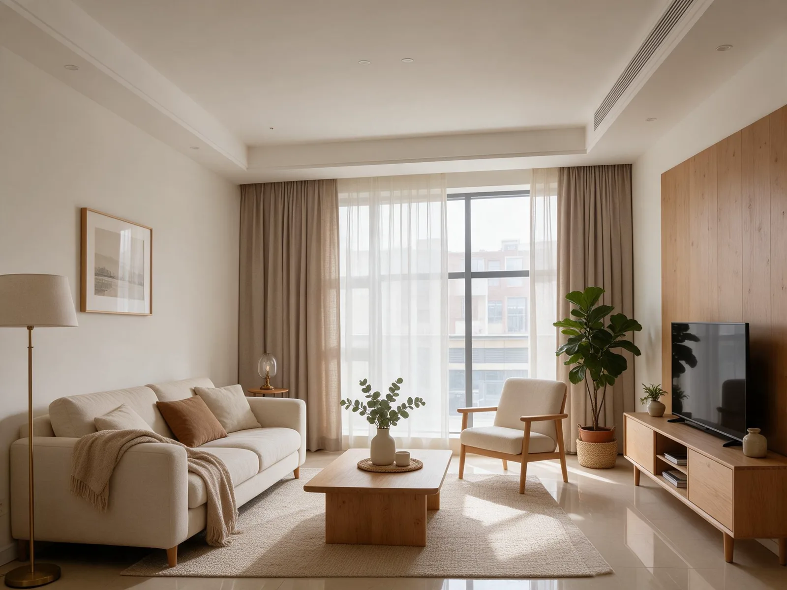
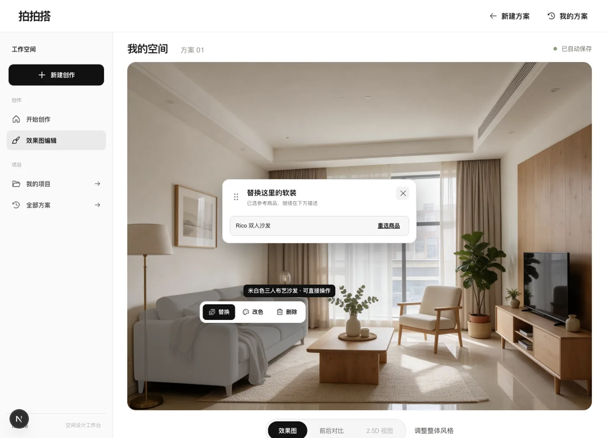
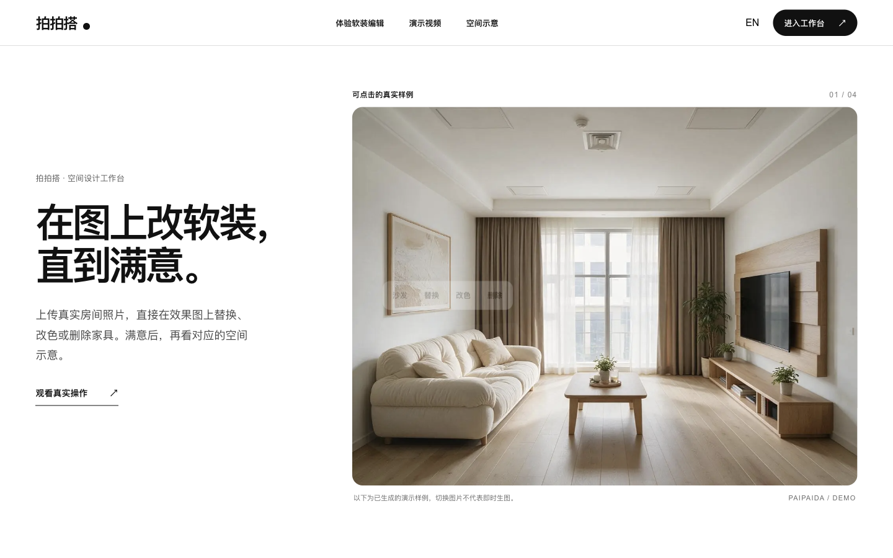

# 拍拍搭 Paipaida

[中文](README.md) · [English](README.en.md)

**在真实房间照片里，直接把软装改到满意。**

上传房间照片，生成正面效果图；在画面中悬停或点选家具，替换、改色、删除；满意后再查看对应版本的 2.5D 空间示意。适合业主表达想法，也适合设计师与客户一起讨论方案。



> 上图是本项目已验收的演示结果。生图质量仍受原照片、视角和模型影响；不能保证任意房间一次生成就符合预期。

## 一眼看懂

| 从照片开始 | 在图上编辑 | 确认后看空间 |
| --- | --- | --- |
| 原房间、整体风格参考和指定家具参考可以分开提供。 | 已识别家具可在图上替换、改色、删除；选品窗可拖动。 | 2.5D 与确认的正面版本对应，是摆放示意，不是精确户型。 |



[观看 29 秒 OBS 操作录屏](frontend/public/site/obs-interaction-demo.mp4) · [查看对应的 2.5D 页面](frontend/public/site/approved-25d-ui.webp)

这段视频连续录下已验收方案中的家具悬停、选品窗拖动和改色入口，配乐为本项目原创合成。**它不包含随机新图生成，也不代表现场生图成功率**。

## 工作台全流程视频

[观看 1080P 工作台演示](frontend/public/site/product-workflow-demo.mp4)：邀请码登录、上传与填写要求、已验收效果图的软装悬停与选品窗拖动、结构核对、2.5D、历史版本和多空间项目。视频约 2 分 15 秒，OBS 录制并配原创轻音乐。

上传段使用 [Curtis Adams / Pexels 的公开空房样例](https://www.pexels.com/photo/empty-bedroom-10099332/)，后续接续**另一份**已验收 01 方案；片中明确标注，不冒充现场生图。历史确认页的原图细节已遮蔽，也没有提交新的付费编辑。邀请码在录屏中隐藏。

## 官网交互预览



在 `/website` 页面，把鼠标移到首屏沙发（手机点沙发），即可查看替换、改色、删除的交互。画面切换使用同一房间预先生成的样例，**不是现场生图**。页面中部还可拖动滑块，对照[公开空卧室原始照片](https://www.pexels.com/photo/empty-bedroom-10099332/)与基于它生成的同机位布置图。照片来源为 Curtis Adams / Pexels；拖动不会重新生图。可切换中英文，继续浏览完整工作台录屏和 2.5D 示意。官网目前仅提供本机预览，尚未公网部署。

## 已实现

- 邀请码登录、用户数据隔离、上传与历史方案。
- 单空间与多空间项目；同一项目共享风格方向，各房间独立保留版本。
- 正面图生成、反馈重生成、软装替换/改色/删除、版本恢复。
- 已准备图层的家具悬停反馈、图旁可拖动的选品窗。
- 用户确认正面图后生成对应 2.5D；演示目录现有 28 件家具软装、9 类。

## 本机运行

```bash
cp .env.example .env
cd backend
python3 -m venv .venv
.venv/bin/pip install -r requirements.txt
.venv/bin/uvicorn app.main:app --host 127.0.0.1 --port 8000
```

另开终端：

```bash
cd frontend
npm install
NEXT_PUBLIC_API_BASE_URL=http://127.0.0.1:8000/api/v1 npm run dev
```

工作台：`http://127.0.0.1:3000/` · 官网预览：`http://127.0.0.1:3000/website`

配置与开发细节见 [开发指南](DEVELOPMENT_GUIDE.md)；项目决策与验收边界见 [项目状态](docs/项目状态.md)。

## 公开范围

本仓库公开代码、测试、配置模板、文字资料和经选定的演示结果。邀请码、密钥、数据库、原始房间照片及品牌商品主图不在仓库里。品牌图仅供本机产品演示，未取得再分发许可；克隆仓库后请使用自己的测试图片，并在没有自备商品图时保持 `DEMO_PRODUCT_CATALOG=0`。正式上线尚未完成。
