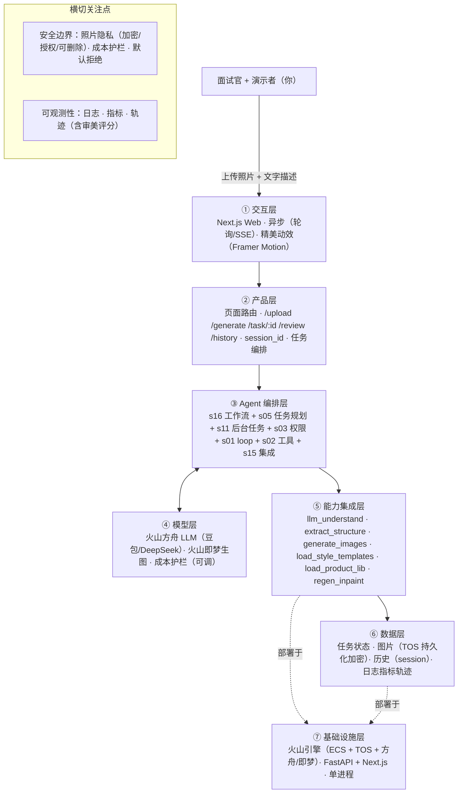

# PRD 推导方案 ——「SnapSpace / 拍拍搭（AI软装 AIGC）」· 修订版 v3

> 状态：方案基本定稿（Step 1–4 完成；Step 5 代码生成此前确认**不执行**，可随时按需启动）
> 推导引擎：Agent Blueprint
> **执行方式：当前 AI 按手册（BLUEPRINT.md）人工分析，未运行模型管线**。组件选型由引擎规则代码 `select_components` 复现；其余为人工判断。

**v3 修订依据（用户已确认的 5 条 + 软装库问题）**：
1. 审图人 = **你自己**；
2. 云平台 = **火山引擎**（全家桶：方舟 LLM + 即梦生图 + TOS 对象存储）；
3. 生图"2.5D 等距 + 结构锁透视"精度 = **看实测**（列为 Day 2 技术验证项）；
4. 成本 = **可调**（¥0.5 仅为参考，按火山实测核价）；
5. 用途 = **面试**，关键要"做得出来"，**前端页面与交互必须精美**；
6. 软装库来源 = 内置风格库 + 内置商品库（商品图用即梦预生成白底图，详见下节）。

**一句话关键判断**：这份 PRD 描述的是一个**固定编排的 AIGC 工作流**，不是自主 Agent——LLM 只承担"理解意图 → 出 prompt/设计说明"的单次步骤，画图由生图模型完成。因此引擎主线选 **s16 工作流运行时**，s01 的 Agent Loop 在此退化为单次 LLM 调用。

---

## 产品定位（一句话）

**SnapSpace / 拍拍搭**：上传一张房间照片，用自然语言描述想要的风格，AI 在十几秒内生成正面效果图和 2.5D 互动方案（正面图负责"好看"，2.5D 负责"好玩"，LLM 负责"听懂你"，生图模型负责"画出来"，你负责把关"好不好看"）。

---

## ★ 软装库来源方案（重点）

软装库分两个，来源不同：

**库 A · 软装风格库（喂给 LLM 的"风格词典"，纯文本）**
- 来源：**内置手写**，写进 `styles.json`（几十行）。
- 内容：6–8 个风格（奶油 / 原木日式 / 现代极简 / 法式 / 侘寂 / 北欧 / 复古 / 意式轻奢），每个风格含 prompt 模板 + 配色/材质/典型单品关键词。

**库 B · 软装商品库（热点商品卡，要有图才好看）**
- 来源：**内置精选 + AI 预生成商品图**（不靠爬虫、不靠外部数据）。
- 元数据：30–50 件商品，字段 = 名称/品类/品牌/价格区间/风格标签/颜色，手写或让 LLM 生成一次后固化。
- 商品图：用火山**即梦**生图预生成一批"白底家具单品图"（白底、干净、统一机位），存火山 TOS，URL 写进 JSON。
- 效果：点热点弹出的商品卡 = 统一风格的漂亮图 + 合理名称价格，面试专业感强。
- 兜底：若来不及预生成图，退化为"LLM 现场生成元数据 + 免费图库配图"（不够精致，仅作兜底）。

---

## ⚠️ 待确认 / 待办清单（已基本清空）

**已确认**：审图人=你自己；云=火山引擎；成本可调；并发无所谓（面试演示，单进程即可）；用途=面试、前端要精美。

**仅剩 2 项技术验证 / 执行项（非阻塞拍板）**：
1. **生图精度实测（Day 2）**：火山即梦能否稳定输出"2.5D 等距视角 + 结构锁透视"；不达标则切兜底（本地/云上 ComfyUI + SDXL + ControlNet，或改用"正面图 + 45° 俯视 prompt"降低精度要求）。
2. **商品库规模确认**：默认 30–50 件（覆盖 6–8 个风格各 4–6 件），够不够、要不要按风格再各配几张。

---

## Step 1 · 需求拆解（提取硬事实）

| 维度 | 结论 | 状态 | 出处 |
|---|---|---|---|
| 目标 | 上传房间照片 + 自然语言描述，AI 生成正面效果图 + 2.5D 互动方案；**面试演示能完整跑通 + 前端页面与交互精美 + 生成图好看（你本人把关）**；总流程 ≤30s、成本参考 ≤¥0.5（可调） | 明确（v3 修订） | PRD + v3 |
| 用户 | 面试官 + 演示者（你）；25–40 岁业主为主要故事线；境内使用；异步交互；人机比 1:1 | 明确 | PRD 二节 + v3 |
| 核心闭环 | 照片+文字 → LLM 理解输出 JSON/prompt → 结构控制锁透视 → 生图出正面图+2.5D 图 → **你审图（评分 ≥4 通过）** → 前端双 Tab + 对比滑块 + 热点商品卡 + 设计说明 | 明确（含审图） | PRD 三/九节 + v3 |
| 交付物 | 正面效果图 + 2.5D 等距图 + 设计说明文案 + 热点商品数据（内置软装库） | 明确 | PRD 三/四节 + v3 |
| 边界 | 不训模型、不做真 3D、不接真实电商数据、不做平面图、不考虑商业化、不做用户系统；照片持久化（加密 + 授权 + 可删除） | 明确 | PRD 六节 + v3 |
| 约束 | 时延 LLM ≤3s / 生图 ≤20s / 总 ≤30s；并发单进程即可；成本参考 ≤¥0.5 可调；4 天周期；**火山引擎全家桶（方舟 LLM + 即梦生图 + TOS）**；图 ≤10MB、2048px、≤200 字 | 明确 | PRD 五/十二/十三节 + v3 |

---

## Step 2 · 领域建模（映射 Harness 五要素）

| 要素 | 内容 |
|---|---|
| **工具** | 上传图片接收与持久化（/api/upload→火山 TOS）；调用火山方舟 LLM 理解意图、生成 prompt/设计说明/热点商品元数据；调用火山即梦生图（正面图 + 2.5D 图 + 局部重绘微调）；内置风格库查询；内置商品库查询；热点数据组装；你本人审图提交（approve/reject + 评分） |
| **知识** | 内置软装风格库 `styles.json`（6–8 风格）；内置软装商品库 `products.json`（30–50 件，含即梦预生成白底图 URL）；生图正负面 prompt 规范（正面=24mm 写实、2.5D=等距俯视）；设计说明文案规则（配色/采光/布局"为什么"）；审美验收标准（构图/风格贴合/可用性） |
| **观察** | 任务状态机流转（pending→understanding→analyzing→rendering→**review**→completed/failed）与进度；LLM 输出 JSON 是否通过 schema 校验；图片是否生成成功；**你的审美评分与通过/驳回记录**；耗时/成本日志；错误码 |
| **行动** | REST API 调用（POST /upload、/generate、GET /task/:id、POST /review）；SSE/轮询状态推送；前端交互（上传、输入、对比滑块、热点拖拽、Tab 切换）；火山方舟/即梦 API 调用 |
| **权限** | 照片持久化存火山 TOS、服务端加密、HTTPS、上传前告知并授权、可删除；无用户系统、无支付、无对外发送；生图/LLM 调用成本护栏（可调）；结果仅本 session 可见；审图节点由你本人操作 |

---

## Step 3 · 组件选型（宁可少选）

| 组件 | 选否 | 理由 | 参考 |
|---|---|---|---|
| s01 Agent Loop | ✅ 必选 | 一切基础：循环 + 工具（引擎恒选；本产品中退化为单次 LLM 调用） | s01_agent_loop/README.md |
| s02 工具系统 | ✅ 必选 | 需要调用外部系统/API/数据源（火山方舟 LLM、即梦生图、TOS） | s02_tool_use/README.md |
| s03 权限系统 | ✅ 必选 | 照片持久化 + 隐私合规，需授权/加密/访问控制/删除权 | s03_permission/README.md |
| s04 钩子系统 | ❌ 放弃 | 无合规审计/拦截强制要求；埋点由可观测性覆盖 | s04_hooks/README.md |
| s05 任务规划 | ✅ 必选 | 任务状态机 pending→…→review→completed/failed，前端轮询进度（含你审图态） | s05_todo_write/README.md |
| s06 子 Agent | ❌ 放弃 | 单次任务上下文小；"并行生成 2 张图"是 API 调用级并行，非子 Agent 隔离 | s06_subagent/README.md |
| s07 技能加载 | ❌ 放弃 | 风格库仅 6–8 个内置模板，规模小，无需按需加载 | s07_skill_loading/README.md |
| s08 上下文压缩 | ❌ 放弃 | 单次生成会话短，历史仅列表查询 | s08_context_compact/README.md |
| s09 记忆系统 | ❌ 放弃 | 演示不做用户系统、不跨会话记偏好 | s09_memory/README.md |
| s10 任务系统 | ❌ 放弃 | 单次生成任务，状态存内存 Map 即可，无需断点续跑 | s10_task_system/README.md |
| s11 后台任务 | ✅ 必选 | 生图 ≤20s、总流程 ≤30s，需后台异步执行 + 完成通知 + 轮询 | s11_background_tasks/README.md |
| s12 定时调度 | ❌ 放弃 | 无定时自动触发需求 | s12_cron_scheduler/README.md |
| s13 Agent 团队 | ❌ 放弃 | 面试演示单用户串行，无多任务并行/隔离工作区 | s13_agent_teams/README.md |
| s14 MCP 插件 | ❌ 放弃 | 直连火山方舟与即梦 API，不接 MCP 生态，s02 已覆盖 | s14_mcp_plugin/README.md |
| s15 集成 Harness | ✅ 必选 | 已选 4 个可选组件（s03/s05/s11/s16），需归一到单一循环 | s15_integrated_harness/README.md |
| s16 工作流运行时 | ✅ 必选 | 编排顺序固定（LLM→结构控制→生图→审图→组装），适合写死为工作流 | s16_workflow_runtime/README.md |
| s17 目标闭环 | ❌ 放弃 | "好不好看"由**你**判定（人工审图），不是自动判断；若未来要 AI 自动评图再引入 s17 | s17_goal_loop/README.md |

**结论**：仍是"固定工作流 + 权限边界 + 任务进度 + 后台慢操作 + 人工审图"，选型收敛 7 个组件（s01/s02/s03/s05/s11/s15/s16）。

---

## Step 4 · 架构设计

### 分层架构图（7 层 + 数据流）



**贯穿数据流**：用户上传照片+文字 → `/generate` 创建任务 → s16 固定工作流：s11 后台 → s02 调 `llm_understand`（④ 火山方舟）→ `extract_structure` + `generate_images`（⑤ 即梦）→ s05 进入 **review 待审态** → 你 approve（评分 ≥4）→ completed；reject → 换风格重生成（最多 3 次）→ 前端轮询/SSE 渲染（①）。

| 层 | 名称 | 回答的问题 | 落地锚点 |
|---|---|---|---|
| ① | 交互层 | 谁在用、怎么用？ | Next.js Web；异步轮询/SSE；**Framer Motion 动效，页面与交互精美** |
| ② | 产品层 | 产品外壳是什么？ | 页面路由 + 请求路由 + session_id + 任务编排 + 审图提交入口 |
| ③ | Agent 编排层 | Harness 如何运转？ | s16 固定工作流 + s05 状态机（含 review）+ s11 后台 + s03 权限 + s01/s02 + s15 |
| ④ | 模型层 | 智能从哪来？ | 火山方舟 LLM（豆包/DeepSeek）+ 火山即梦生图；成本护栏可调 |
| ⑤ | 能力集成层 | 如何触达外部世界？ | 火山方舟 API、即梦生图 API、火山 TOS、内置风格库/商品库 |
| ⑥ | 数据层 | 什么需要持久化？ | 任务状态、图片（TOS 加密）、历史记录、日志/指标/轨迹 |
| ⑦ | 基础设施层 | 如何部署运行？ | 火山引擎（ECS + TOS + 方舟/即梦），FastAPI + Next.js，单进程 |

### 工具清单

| 工具 | 输入 | 输出 | 副作用 | 权限 | 归属层 |
|---|---|---|---|---|---|
| `llm_understand` | 照片 URL + 用户文字描述 | 结构化 JSON（style/colors/sd_prompts/design_notes/layout_hints/hotspots） | 消耗 LLM token/成本 | allow | ⑤ |
| `extract_structure` | 照片 URL | 结构控制图（边缘/深度，用于锁透视） | 调用即梦预处理，写临时图 | allow | ⑤ |
| `generate_images` | sd_prompts(front/isometric) + negative_prompt + 结构控制图 | 正面图 URL + 2.5D 图 URL + 耗时 | 消耗即梦生图额度，写 TOS | allow | ⑤ |
| `load_style_templates` | style 标签 | 风格 prompt 模板 + 配色/材质语料 | 读内置 styles.json | allow | ⑤ |
| `load_product_lib` | style + layout_hints | 热点商品数据（内置软装库 + 预生成图） | 读内置 products.json | allow | ⑤ |
| `store_asset` | 二进制图片/生成结果 | 可访问 URL | 写火山 TOS（加密） | allow | ⑥ |
| `update_task_status` | task_id + status + progress + step_details | 最新任务状态 | 写任务状态（内存 Map），含 review 态 | allow | ⑥ |
| `regen_inpaint` | task_id + 修改描述（"把沙发换皮质"） | 新 task_id | LLM 解析 + 即梦局部重绘 + 写状态 | ask | ⑤ |
| `submit_review` | task_id + approve/reject + 审美评分 | 更新后任务状态（completed / 重新生成） | 写状态，可能触发换风格重生成 | ask | ② |

### 系统提示词草案

```text
身份：你是"拍拍搭"软装设计 AI，把用户的房间照片和一句风格描述，
转化为可执行的生图方案与可解释的设计说明。

规则：
- 只输出符合 schema 的结构化 JSON（style/colors/mood/budget_level/
  members/elements/avoid/sd_prompts/negative_prompt/design_notes/
  layout_hints/hotspots），字段必须完整。
- 正面图 prompt 用"真人视角、24mm 镜头、写实摄影、8k"；
  2.5D 图 prompt 用"等距视角、45 度俯视、3D 渲染、blender"。
- 设计说明必须可解释：每条关联"为什么"（配色/采光/布局逻辑），不超过 3 条。
- 审美底线：生成的方案必须美观、风格贴合用户描述、构图完整，
  避免透视畸变、杂乱元素、廉价质感；这是交付门槛。
- 热点商品从内置软装库映射（load_product_lib），不要虚构库外商品。
- 边界：不生成脱离用户照片空间结构的内容；不处理用户未授权的内容。
- 用户未提及的字段（预算/成员等）用合理默认值并在 design_notes 说明，不得编造事实。

工具说明：llm_understand（本步骤）、extract_structure、generate_images、
load_style_templates、load_product_lib、regen_inpaint 由后端编排调用，你只需输出 JSON。

知识目录：内置软装风格库 styles.json、软装商品库 products.json、生图 prompt 规范、设计说明文案规则。
```

### 上下文与记忆策略

- **会话内**：单次生成任务上下文极小（照片 + ≤200 字描述 + 一次 LLM JSON），无需压缩。任务状态机用内存 Map 存进度（含 review 待审态），任务完成后保留结果供历史查询。
- **跨会话**：演示阶段不持久化用户偏好（不做用户系统）。历史记录按 session_id 存列表，含照片与生成结果（持久化，供回看）；二期商业化再引入 s09 记忆系统。

### 安全边界与降级策略

- 照片隐私合规 → 照片持久化存火山 TOS，服务端加密 + HTTPS；上传前告知用途并授权；提供删除入口，删除后不可恢复；历史按 session 隔离，不对外发送。
- LLM 失败/幻觉（JSON 缺失、布局臆造）→ schema 校验 + 一次纠错重试；仍失败置 failed。
- LLM 超时（>3s）→ 降级切换备用模型；再超时置 failed。
- 生图失败/超时（>20s 或 URL 不可访问）→ 切备用生图（本地/云上 ComfyUI 兜底）；仍失败置 failed + 错误码 + 重试按钮。
- 审美不过（评分 <4）→ 自动换风格重生成（最多 3 次）；仍不过转预生成 demo。
- 越权/未授权 → 仅 session_id 隔离；历史只返回本 session；不对外发送照片。
- 成本超限 → 护栏上限可调（参考 ¥0.5，按火山实测核价），超限停止转 demo 兜底。
- 演示兜底 → task_id 以 `demo_` 开头时直接走本地预生成 JSON；面试现场可"一键通过审图"避免卡壳。

### 可观测性

- 日志：任务状态流转日志（含 review 态）；LLM 输入输出 JSON 日志；即梦生图耗时与错误码；图片 URL 可访问性检查；审图通过/驳回记录。
- 指标：端到端耗时（≤30s）；LLM 耗时（≤3s）；生图耗时（≤20s）；单次成本（参考 ¥0.5 可调）；成功率/失败率；**审美评分分布（≥4/5）与一次通过率**。
- 轨迹：每个 task_id 记录完整轨迹（描述→LLM JSON→结构控制图→生图 prompt→结果 URL→审美评分与结论→状态流转），作调优语料。

### 技术栈与部署形态

- 部署：**火山引擎全家桶**（ECS 云服务器 + TOS 对象存储 + 方舟 LLM + 即梦生图），域名已备案；后端 FastAPI 单进程 + 内存 Map；前端 Next.js。
- 语言：Python（FastAPI）+ TypeScript（Next.js）。
- 模型：火山方舟 LLM（豆包 / DeepSeek，实测选一）；生图走火山即梦（主）/ 本地或云上 ComfyUI + SDXL + ControlNet（备，结构控制精度更高，看实测）。
- 前端精美：PRD 已给的动效清单（上传拖拽发光、分阶段加载动画、打字机 JSON、边缘图绘制动画、进度粒子、对比滑块 clip-path、热点呼吸光晕、商品卡 spring 弹出）全部保留并作为面试重点打磨项。

---

## 验收标准对照（可落地 vs demo）

| 标准 | 要求 | 本方案的对应设计 |
|---|---|---|
| 可运行 | 一条命令能起，配置与密钥外置 | FastAPI + Next.js，火山密钥走 .env |
| 可容错 | 工具失败、幻觉、超时、越权有降级路径 | LLM 纠错重试 + 备用模型 + 备用生图 + 审美不过重生成 + demo 兜底 + 成本护栏 |
| 可观测 | 有日志、指标、轨迹 | 状态流转日志、耗时/成本/审美评分指标、task_id 全轨迹 |
| 可测试 | 核心循环与权限边界有单测 | 若写代码：状态机与照片授权/删除边界单测；PRD 10 项 Gate 转集成测试 |
| 可部署 | 明确部署形态与启动文档 | 火山引擎（ECS+TOS+方舟/即梦）+ 备案域名 |
| 可度量 | 有对齐 PRD 的成功指标并能采集 | 耗时（30/3/20s）、成本（可调）、**审美评分 ≥4/5、一次通过率** |

**面试项目专属优先级**：可演示（做得出来）> 前端精美 > 架构完备 > 性能调优。架构按上图搭，但精力大头放前端动效与交互。

---

## 审稿意见（当前 AI 自查，非独立模型审稿）

> 未运行模型管线，此节是当前 AI 对照验收标准做的自查，**不等同于独立模型审稿通过**。

- 结论：方案基本定稿（自查发现问题已收敛，仅剩技术验证项）
- 自查发现：
  - [high] 火山即梦对"2.5D 等距 + 结构锁透视"的精度未验证，是 Day 2 技术阻断点；需实测，不达标切 ComfyUI 兜底（已列待办 #1）。
  - [medium] 人工审图会让端到端时延不可控（人没点通过就卡 review 态）；面试现场建议预置"一键通过"或预生成方案直通，避免演示卡壳。
  - [low] 商品库图由即梦预生成，需统一"白底、统一机位、统一光"的出图参数，否则商品卡观感乱。

---

## 下一步

1. 方案已基本定稿，**剩余待办只有 2 项**：生图精度 Day 2 实测、商品库 30–50 件规模确认。
2. **代码生成此前你确认不执行**。现在目标是"面试要做得出来"，需要我帮你搭骨架 / 写前端页面与动效，随时说一声就启动（引擎默认"先方案后代码"，本方案 Step 1–4 已交付，可进入 Step 5）。
3. 建议的动手顺序（供你参考）：先 `styles.json` + `products.json`（软装库）→ 后端工作流打通（上传→LLM→生图→审图）→ 前端首页/加载页/结果页三页动效 → 预生成 demo 兜底。

> 附：本目录未生成 plan.json。引擎正向管线（含结构化 plan.json 与独立模型审稿）需在引擎 `.env` 配置有效 `ANTHROPIC_API_KEY` 后运行：
> `cd '<本机路径已省略>' && .venv/bin/python -m blueprint plan '<本机路径已省略>' -o 'out/AI软装AIGC产品-plan'`
